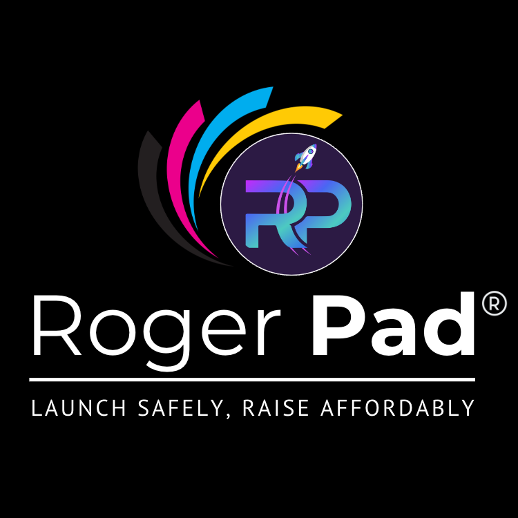

# Why Rogerpad?

<figure><figcaption></figcaption></figure>

A reliable launchpad is essential in the rapidly evolving crypto space, offering streamlined project launches, enhanced security, increased visibility, and expert guidance. It builds trust and credibility, attracts investor funding, and fosters strong community engagement. By providing these critical resources and support, a dependable launchpad like RogerPad ensures the successful launch and growth of new projects, benefiting both developers and investors alike. [More Info..](../rogerpad/rogerpad/why\_rogerpad/)
