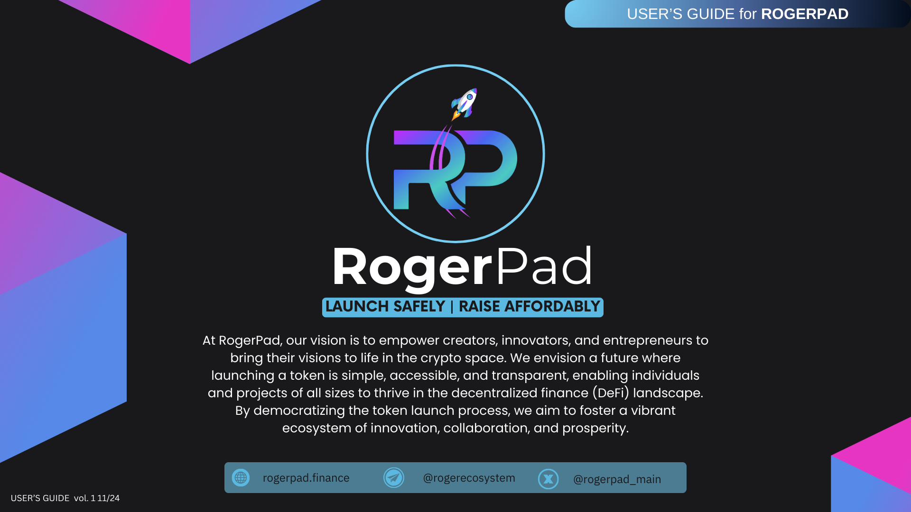

# Whitelist

In a Whitelist Sale, participation is restricted to a predetermined list of approved addresses. These addresses are typically selected based on criteria set by the project team, such as early supporters, community members, or strategic partners. Whitelisted participants are given priority access to the token sale, ensuring that they have the opportunity to contribute before the sale opens to the general public. This type of sale is often used to reward loyal community members or to comply with regulatory requirements in certain jurisdictions. Whitelist sales can help projects build hype and momentum leading up to the token launch while fostering a sense of exclusivity among participants.

<figure><figcaption></figcaption></figure>

