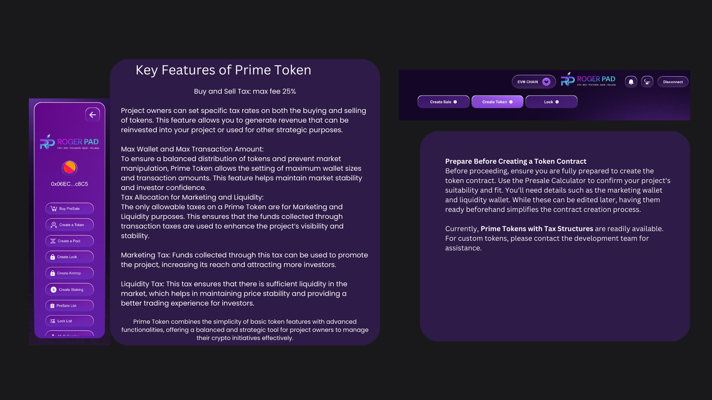
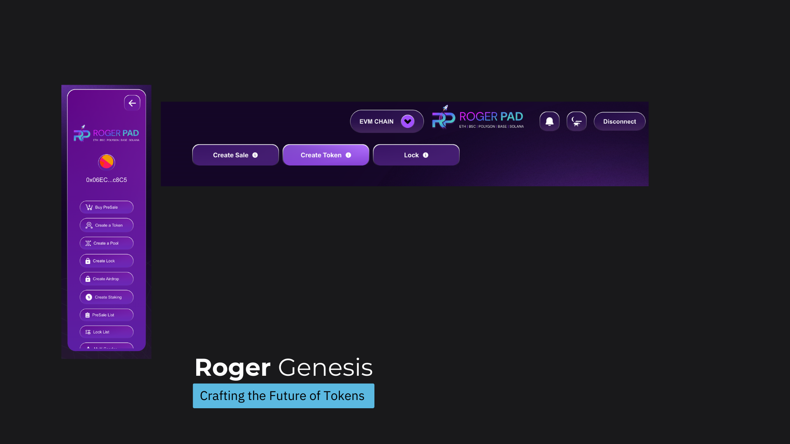

# Badges

In the context of the Roger ecosystem, badges serve as visual indicators of certain attributes or accomplishments associated with projects or individuals. Here are some possible badges and their meanings:

Project badges significantly enhance a project's reputation and build investor confidence by ensuring transparency, security, accountability, and reliability. They demonstrate a commitment to best practices and ethical standards, which is crucial for gaining and maintaining the community's and potential investors' trust.

### [<mark style="color:purple;">**KYC Badge:**</mark>](broken-reference)&#x20;

<figure><figcaption></figcaption></figure>

Indicates that the project has completed a Know Your Customer (KYC) verification process, demonstrating transparency and compliance with regulatory requirements.

Contact one of our Verified KYC Partners to ensure quality certification.  [Check](broken-reference)

### [<mark style="color:purple;">**Audit Badge:**</mark>](broken-reference)&#x20;

<figure><figcaption></figcaption></figure>

This signifies that the project's code, smart contracts, and security practices have been audited by reputable firms, providing assurance of reliability and safety.

Contact one of our Verified Audit Partners to ensure quality certification.  [Check](broken-reference)

### [<mark style="color:purple;">**Based Badge:**</mark>](broken-reference)

<figure><figcaption></figcaption></figure>

&#x20;Represents a project or team that embraces authenticity, non-conformity, or a particular set of values, distinguishing it from others in the ecosystem.

Contact [@Rogerpad\_ceo](https://t.me/rogerpad\_ceo) to get more information and receive a Based Badge if you qualify.. &#x20;

### [<mark style="color:purple;">**SAFU Badge:**</mark>](safu-badge.md)&#x20;

<figure><figcaption></figcaption></figure>

This indicates that the project has implemented measures to ensure the safety and security of user funds or the overall integrity of the project, fostering trust and confidence among stakeholders.&#x20;

Contact [@Rogerpad\_ceo](https://t.me/rogerpad\_ceo) to get more information and receive a SAFU Badge if you qualify..&#x20;

### [<mark style="color:purple;">**Doxx Badge:**</mark> ](doxx-badge.md)

<figure><figcaption></figcaption></figure>

Indicates that the project team has voluntarily revealed their identities or personal information, promoting transparency and accountability within the community.

Contact [@Rogerpad\_ceo](https://t.me/rogerpad\_ceo) to get more information and receive a DOXX Badge if you qualify..&#x20;

> _<mark style="color:purple;">These badges play a vital role in providing users with valuable information about projects and individuals, enabling them to make informed decisions and build trust within the ecosystem.</mark>_
