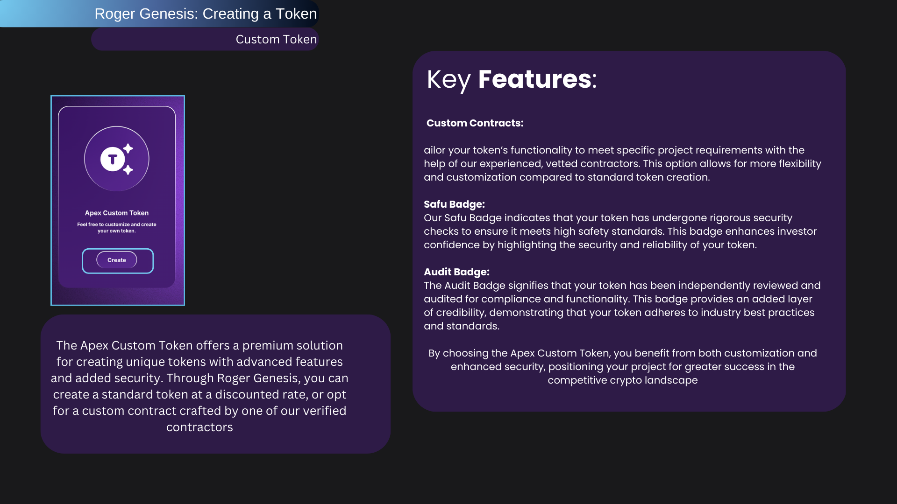

# AUDIT Badge

<figure><figcaption>
AUDIT BADGE
</figcaption></figure>

AUDIT BADGE

The "AUDIT" badge likely indicates that the project associated with it has undergone a formal audit process. In the context of cryptocurrency and blockchain projects, an audit is a thorough examination of the project's code, smart contracts, security practices, and other relevant aspects conducted by a third-party auditing firm.
