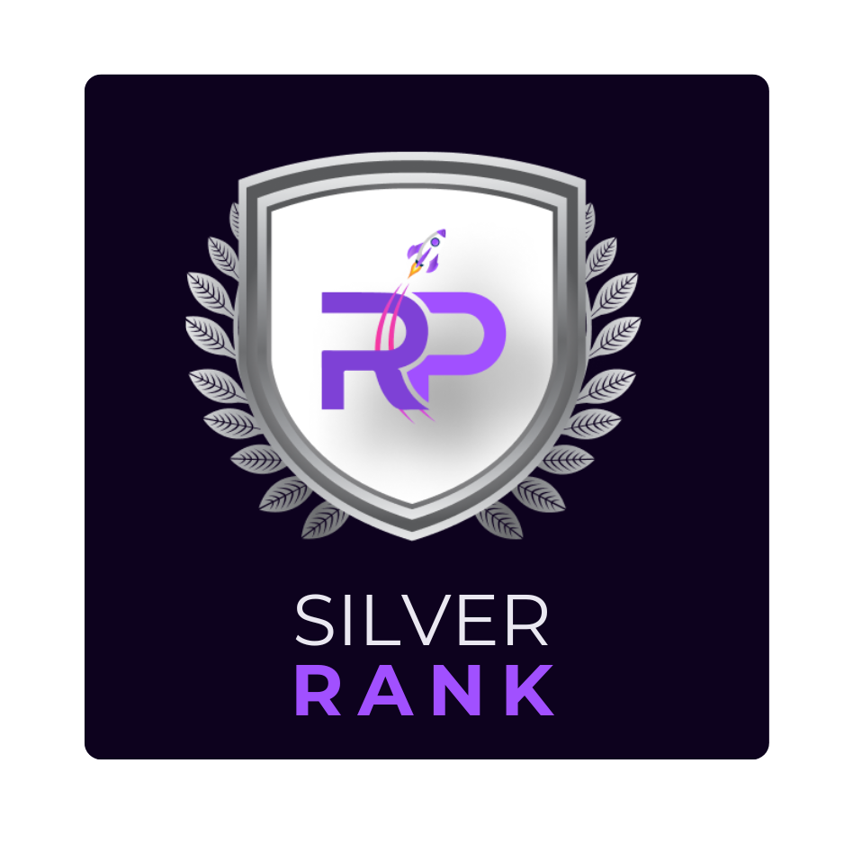

# Silver Rank

<figure><figcaption>
PROJECT RANKING: SILVER
</figcaption></figure>

The Silver Rank, also known as the Common Rank, serves as the entry point for projects on RogerPad. Projects listed in this rank have minimal prerequisites, allowing virtually anyone to create and publish their project on the platform. It's important to note that projects in the Silver Rank do not undergo KYC (Know Your Customer) or AUDIT verification, indicating a basic level of scrutiny. RogerPad retains the right to delist projects from the Silver Rank for safety concerns.

### **Pre-Requirements:**

* No KYC or AUDIT is required.
* Minimum of 2 SOL worth of $ROGER or 500,000 $ROGER Tokens (Whichever is lowest) in the wallet.
* Any contract can be deployed.


### Disclaimer:&#x20;

While Roger LaunchPad's additions to sales have made them safer they are not without risks. Please only buy into the sales with teams you trust and know. By participating in any kind of sale you are agreeing that you understand the risks and nothing Roger LaunchPad or any of Roger LaunchPad's representatives say should be taken as FA and we always advise to our community to DYOR.


<mark style="color:red;">Roger LaunchPad reserves the right to refuse a project from launching under ANY OF THESE TIER</mark>
