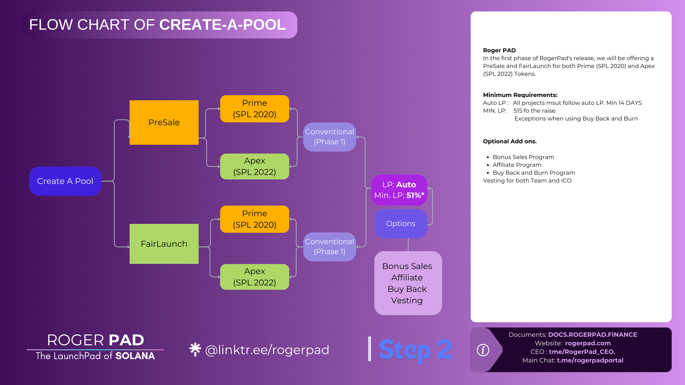

# Diamond Ranking

<figure><figcaption></figcaption></figure>

Attaining the distinguished Diamond Ranking tier within the Roger ecosystem represents the epitome of commitment and involvement. This esteemed tier is reserved for individuals who demonstrate an exceptional level of dedication and investment in the ecosystem's advancement and prosperity.

&#x20;To qualify for the coveted Diamond Ranking tier, holders must meet stringent criteria that underscore their significant contribution and support. Specifically, individuals aspiring to this prestigious tier must maintain ownership of a minimum of 10 sol  Roger Tokens in their portfolio. This substantial token holding not only signifies a substantial financial investment but also reflects a profound belief in the long-term viability and growth potential of the ecosystem.

&#x20;In addition to token ownership, holders must also possess a minimum of two Roger NFTs. These NFTs, each representing a unique digital asset within the ecosystem, serve as tangible symbols of the holder's commitment to the community's creative endeavors and cultural expression. By owning multiple NFTs, holders further solidify their status as influential members within the ecosystem, contributing to its vibrant and dynamic community.

&#x20;Achieving the Diamond Ranking tier is a testament to the holder's unwavering dedication, commitment, and belief in the Roger ecosystem's vision and objectives. It represents a significant milestone, signifying the holder's pivotal role in shaping the ecosystem's future success and prosperity. As key stakeholders, Diamond Ranking holders play a crucial role in driving innovation, fostering growth, and ensuring the ecosystem's continued evolution as a leading force within the digital landscape.

&#x20;Minimum $ROGER to hold:            10 sol

Minimum ROGER NFT to hold:       1

\

&#x20;
