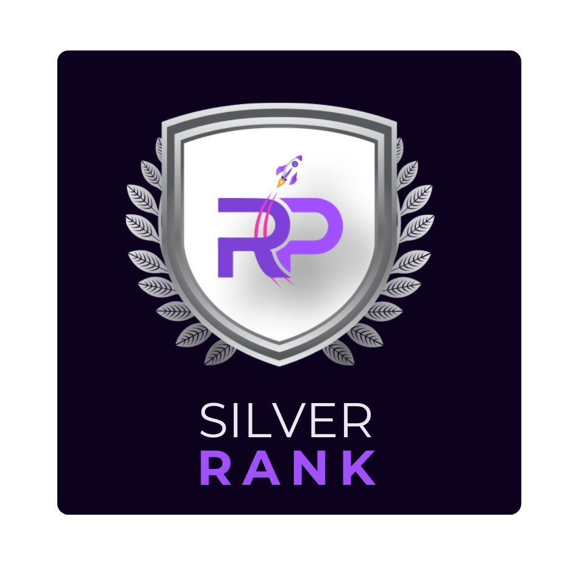

# Silver Ranking

<figure><figcaption></figcaption></figure>

Achieving the esteemed Silver Ranking tier within the Roger ecosystem entails more than just meeting numerical thresholds; it represents a comprehensive commitment to the values and goals of the community. By accumulating a substantial holding of at least 1 sol  Roger Tokens, individuals not only demonstrate a significant financial investment but also signal their belief in the long-term viability and potential of the ecosystem. This level of token ownership indicates a vested interest in the success and development of Roger's initiatives.

&#x20;Moreover, the possession of at least one Roger NFT adds a layer of significance to attaining the Silver Ranking. Unlike mere token holdings, owning an NFT signifies a deeper connection to the Roger community and its creative expression. Each NFT is a unique digital asset, imbued with its own artistic flair and symbolic value. By owning one, individuals not only gain access to exclusive benefits and privileges but also become part of a vibrant community of collectors and enthusiasts.

&#x20;Minimum $ROGER to hold:            1 SOL

Minimum ROGER NFT to hold:       1

&#x20;In essence, the Silver Ranking is a testament to the holder's multifaceted engagement within the Roger ecosystem. It signifies not only financial investment but also active participation in the community's cultural and creative endeavors. As such, achieving this rank is not merely a milestone but a recognition of dedication, passion, and belief in the future of Roger.
