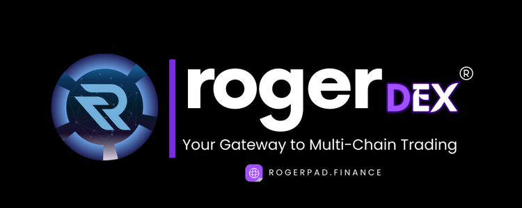

# 🔵 Roger DEX



<figure><figcaption>
PHASE 6
</figcaption></figure>

Roger DEX is a decentralized exchange (DEX) that lets you trade digital assets across major blockchain networks. With easy access to multiple chains and great liquidity, Roger DEX is the ideal platform for multi-chain trading. Here’s why:

* **Multi-Chain Support:** Trade tokens from Ethereum, Binance Smart Chain, Polygon, Solana, and more—all in one place. Roger DEX makes trading across different blockchains simple and hassle-free.
* **High Liquidity and Fast Trades:** By pooling liquidity from various chains, Roger DEX offers better prices and fast trade execution. This ensures smooth trading with minimal price slippage.
* **Easy-to-Use Interface:** Whether you're new to trading or experienced, Roger DEX's user-friendly interface makes it simple to navigate markets and trade efficiently.
* **Strong Security:** Your assets are safe with Roger DEX’s secure smart contracts, regular audits, and top-notch security protocols to protect your funds and data.
* **Decentralized and Transparent:** Trade in a fully decentralized environment where every transaction is recorded on the blockchain, ensuring full transparency and trust.
* **Advanced Trading Features:** Take advantage of options like limit orders, stop-loss tools, and real-time analytics to improve your trading strategy and seize opportunities.
* **Active Community:** Join a thriving community of traders and developers. Get involved in platform governance and help shape the future of decentralized finance with Roger DEX.

Unlock the potential of multi-chain trading with Roger DEX. Whether you’re diversifying your portfolio or exploring new investments, Roger DEX gives you the tools and resources to succeed.

**Part of the Roger Ecosystem**&#x20;

**Support:**\
For help, contact us via Telegram at @[RogerPad\_Support ](https://t.me/RogerPad\_Support)or email at [support@rogerpad.finance.](mailto:support@rogerpad.finance.)\
For urgent matters, reach the CEO directly on Telegram at[ @rogerpad.](https://t.me/rogerpad.)
