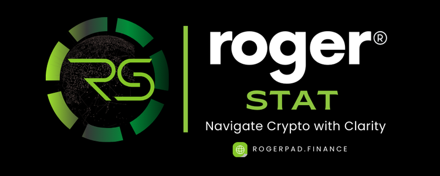

# 🔵 Roger Stat



<figure><figcaption>
PHASE 10
</figcaption></figure>

Roger Stat is your go-to platform for clear and accurate cryptocurrency market insights. As a great alternative to sites like CoinMarketCap and CoinGecko, Roger Stat provides up-to-date information with ease and reliability. Here’s what it offers:

* **Accurate Market Data:** Get real-time prices, market cap, trading volumes, and historical data for a variety of cryptocurrencies.
* **Multi-Chain Tracking:** Track tokens from different blockchain networks like Ethereum, Binance Smart Chain, Polygon, Solana, and more—all in one place.
* **Easy-to-Use Interface:** Navigate charts, graphs, and token details easily with a user-friendly design made for beginners and experienced traders alike.
* **Advanced Analytics:** Explore deeper insights with advanced tools like price charts, market trends, and performance metrics to guide your trading decisions.
* **Custom Alerts:** Set alerts for price changes, trading volume spikes, and important market events so you can stay ahead.
* **Community Interaction:** Join a vibrant community of investors and developers, where you can share insights and stay updated on the latest crypto news.

Roger Stat helps you stay on top of the fast-paced crypto world with reliable data and smart tools to support your investments.

**Part of the Roger Ecosystem**

**Support:**\
For help, contact us via Telegram at @[RogerPad\_Support ](https://t.me/RogerPad\_Support)or email at [support@rogerpad.finance.](mailto:support@rogerpad.finance.)\
For urgent matters, reach the CEO directly on Telegram at[ @rogerpad.](https://t.me/rogerpad.)
