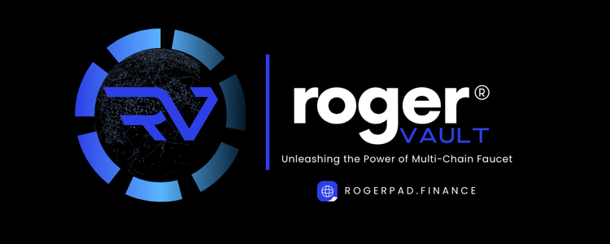

# 🔵 Roger Vault



<figure><figcaption>
PHASE 6
</figcaption></figure>

### Roger Vault: Unlock the Power of Multi-Chain Token Exchange

Roger Vault is a versatile platform that simplifies token exchanges across multiple blockchain networks. Designed to streamline the process, it enables users to seamlessly swap cryptocurrencies, making it easier to navigate the decentralized finance landscape.

**Effortless Token Swaps**\
Roger Vault allows users to exchange tokens without needing multiple accounts or navigating complex interfaces. The platform is intuitive, offering a smooth experience for both beginners and seasoned cryptocurrency enthusiasts.

**Comprehensive Exchange Solution**\
Whether you’re diversifying your portfolio, leveraging arbitrage opportunities, or simply swapping tokens for convenience, Roger Vault provides a complete solution. With support for a wide range of cryptocurrencies, accessing the assets you need is simple and efficient.

**Advanced Features for Maximum Returns**\
Beyond token swaps, Roger Vault offers advanced features like liquidity pooling and yield farming. These features allow users to optimize their investments and take full advantage of the opportunities available in the cryptocurrency market.

**User-Focused, Multi-Chain Functionality**\
With its focus on usability, accessibility, and functionality, Roger Vault is poised to be the leading platform for token exchanges across multiple blockchains. It’s your gateway to unlocking the full potential of decentralized finance.

**Part of the Roger Ecosystem**

#### Support:

#### For assistance, contact us via Telegram at [@RogerPad\_Support ](https://t.me/RogerPad\_Support)or email at [support@rogerpad.finance](mailto:support@rogerpad.finance). For urgent matters, contact the CEO directly on Telegram at [@rogerpad.](https://t.me/rogerpad)
