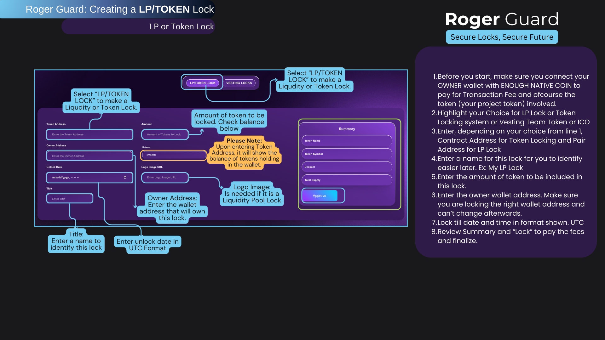

# 🔵 Roger View



<figure><figcaption>
PHASE 7
</figcaption></figure>

Roger View gives users comprehensive access to market insights and data through an innovative price analysis tool. With Roger View, users can easily explore key details and charts to make well-informed decisions in the fast-paced cryptocurrency market.

**User-Friendly Interface**\
Our platform is designed to be intuitive, offering a seamless experience for both experienced traders and newcomers. With Roger View, navigating market data is simple and efficient.

**Real-Time Data and Analysis**\
Through our price-maker tool, users can access live price data, historical charts, and trends for a wide variety of cryptocurrencies. Whether you're tracking your favorite digital assets or conducting detailed market analysis, Roger View equips you with the tools needed for smart decision-making.

**Expert Insights and Market Trends**\
Beyond charts and data, Roger View offers expert market analysis and insights. Stay updated on the latest trends, developments, and opportunities in the crypto world.

**Comprehensive and Accessible**\
With a focus on usability and functionality, Roger View is the ultimate resource for understanding the cryptocurrency market. Join us to gain valuable insights and stay ahead in the ever-evolving world of digital finance.

**Part of the Roger Ecosystem**

**Support:**\
For help, contact us via Telegram at @[RogerPad\_Support ](https://t.me/RogerPad\_Support)or email at [support@rogerpad.finance.](mailto:support@rogerpad.finance.)\
For urgent matters, reach the CEO directly on Telegram at[ @rogerpad.](https://t.me/rogerpad.)

\

&#x20;
