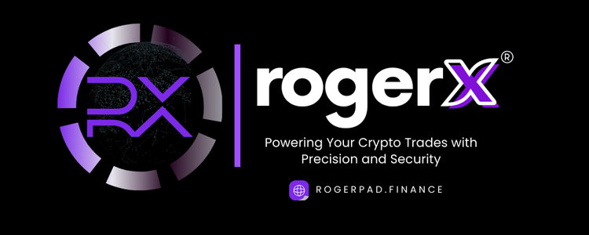

# 🔵 Roger X



<figure><figcaption>
PHASE 10
</figcaption></figure>

Roger X is a centralized cryptocurrency exchange within the Roger ecosystem. It provides a secure platform for buying, selling, and trading a wide variety of cryptocurrencies. With Roger X, users can easily convert digital assets into other cryptocurrencies or even traditional currencies like the US dollar or euro.

### Key Features of Roger X:

* **Wide Range of Trading Pairs:** Trade various cryptocurrencies based on market demand and your own strategies.
* **Essential Market Data:** Access real-time charts, price information, and analytical tools to make informed decisions.
* **Secure Wallet Storage:** Safely store your digital assets directly on the platform.
* **Margin Trading:** Boost your trading positions with leveraged trading options.
* **Lending Services:** Earn interest by lending your digital assets to others.

### Focus on Security:

Roger X is designed with top-notch security features, including:

* Strong encryption to protect your funds and data.
* Regular security audits to ensure maximum protection against cyber threats.
* Constant updates to prevent unauthorized access.

#### Part of the Roger Ecosystem:

Roger X enhances liquidity and accessibility in the crypto market, offering a reliable and easy-to-use platform for both beginners and seasoned traders.

**Support:**\
For help, contact us via Telegram at @[RogerPad\_Support ](https://t.me/RogerPad\_Support)or email at [support@rogerpad.finance.](mailto:support@rogerpad.finance.)\
For urgent matters, reach the CEO directly on Telegram at[ @rogerpad.](https://t.me/rogerpad.)
