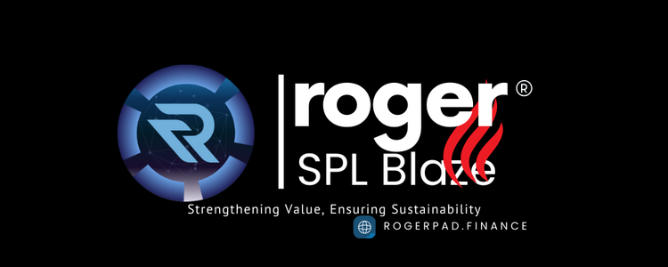

# 🟢 Roger SPL Blaze



<figure><figcaption>
PHASE 1
</figcaption></figure>

Roger SPL Blaze is an advanced, user-friendly solution designed exclusively for the Solana blockchain, enabling developers and token holders to initiate token burns effortlessly. By integrating a seamless buyback and burn mechanism, it empowers projects to reduce circulating token supply, thereby strengthening tokenomics and promoting sustainability.

### Key Features of Roger SPL Blaze:

* Streamlined Token Burns: Roger SPL Blaze allows users to initiate token burns directly from their wallets, whether it’s for reducing surplus tokens or completely removing their holdings. This flexibility enables developers and users to manage token supply according to evolving project goals.
* User-Friendly Interface: The platform is designed with simplicity in mind, allowing users to perform token burns without requiring any technical or coding expertise. This ease of use ensures that both experienced developers and everyday users can effectively engage with the process.
* Impact on Tokenomics: By reducing the overall token supply, projects can enhance token scarcity, increase value for holders, and stabilize long-term market dynamics. Roger SPL Blaze provides the tools to manage token supply efficiently, ensuring a healthier token economy.

### Benefits of Roger SPL Blaze:

* Control Over Token Supply: Projects can strategically manage their token supply by initiating burns, which can help reduce inflation, mitigate oversupply issues, and create a deflationary model that benefits long-term holders.
* Boosting Investor Confidence: By integrating token burns into a project’s roadmap, developers can show a commitment to maintaining the value of their token, fostering greater confidence among investors.
* Solana-Exclusive: Specifically tailored for the Solana blockchain, Roger SPL Blaze leverages the speed and efficiency of Solana, making the burn process swift, cost-effective, and highly scalable.

#### Nominal Fee: There is a small fee associated with utilizing the Roger SPL Blaze service, which ensures the platform remains accessible while covering operational costs.

### Support Information:

* General Support: For any assistance, contact us via Telegram at [RogerPad\_Support](https://t.me/RogerPad\_Support) or via email at [support@rogerpad.finance.](mailto:support@rogerpad.finance.)
* Emergency Contact: For urgent matters, you can reach the CEO directly via Telegram at [rogerpad](https://t.me/rogerpad).
