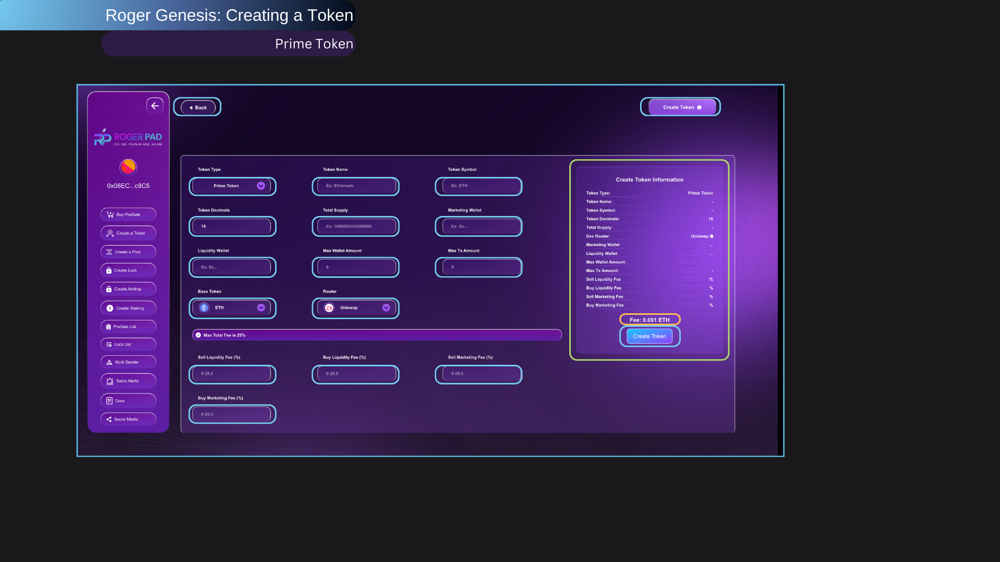

# 🔵 RogerSwap



<figure><figcaption>
PHASE 2
</figcaption></figure>

RogerSwap is a decentralized exchange (DEX) built by RogerPad that allows you to trade and farm cryptocurrencies easily. It gives users a secure way to trade directly without needing centralized exchanges or middlemen.

With RogerSwap, you can swap one cryptocurrency for another while keeping full control of your assets throughout the process. This makes your transactions safer because your assets aren’t held by anyone else.

RogerSwap also offers yield farming, where you can earn rewards by adding liquidity to the platform’s pools. By staking your crypto in these pools, you help support the platform and get extra tokens as rewards.

The platform is designed to be easy to use, even for beginners, while still offering strong security. Whether you want to trade cryptocurrencies or earn from yield farming, RogerSwap is the all-in-one solution.

In short, RogerSwap lets you trade and earn confidently with its decentralized system, ensuring control and access to many investment opportunities.

#### Part of the Roger Ecosystem

#### Support: For assistance, contact us via Telegram at [@RogerPad\_Support ](https://t.me/RogerPad\_Support)or email at [support@rogerpad.finance](mailto:support@rogerpad.finance). For urgent matters, contact the CEO directly on Telegram at [@rogerpad.](https://t.me/rogerpad)
