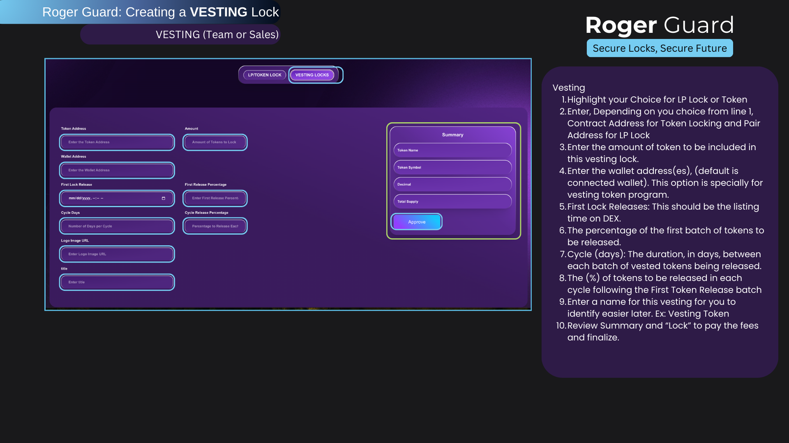

# Roger's Vision

<figure><figcaption></figcaption></figure>

The vision of the ROGER ecosystem is to create a robust and inclusive decentralized financial infrastructure that empowers users, developers, and creators alike. At the heart of our vision is the commitment to democratizing access to financial services and opportunities, regardless of geographical location or socioeconomic status.

&#x20;In the ROGER ecosystem, we envision a seamless integration of cutting-edge technology, innovative financial instruments, and community-driven governance mechanisms. Our goal is to foster a vibrant and thriving ecosystem where individuals can transact, invest, and participate in various financial activities with ease and confidence.

Key components of our vision include:

1. Accessibility: We strive to make financial services accessible to everyone, including those who are underserved or marginalized by traditional banking systems. Through user-friendly interfaces and intuitive platforms, we aim to lower barriers to entry and empower individuals to take control of their financial futures.
2. Innovation: Innovation is at the core of our ecosystem. We are committed to continually pushing the boundaries of what is possible in decentralized finance, exploring new technologies, and developing novel financial products and services that address the evolving needs of our users.
3. Sustainability: We recognize the importance of sustainability in building a resilient financial ecosystem. As such, we are dedicated to implementing environmentally friendly solutions and promoting responsible practices that minimize our ecological footprint.
4. Community-driven governance: We believe that the best decisions are made collaboratively. That's why we are committed to implementing transparent and inclusive governance mechanisms that give our community a voice in shaping the future direction of the ecosystem.

Overall, our vision for the ROGER ecosystem is to create a dynamic and inclusive financial ecosystem that empowers individuals, fosters innovation, and promotes financial freedom for all. Through our collective efforts, we aim to build a better, more equitable future for generations to come.

