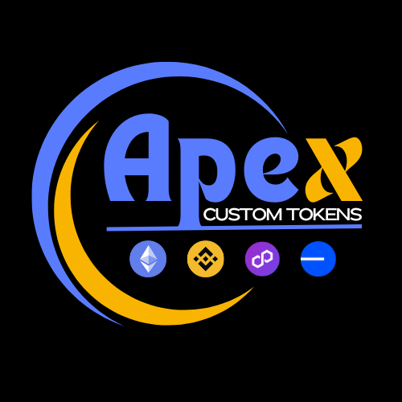

# Apex Token \[evm]

The Apex Custom Token offers a premium solution for creating unique tokens with advanced features and added security. Through Roger Genesis, you can create a standard token at a discounted rate, or opt for a custom contract crafted by one of our verified contractors.

<figure><figcaption></figcaption></figure>

### &#x20;Key Features:

#### &#x20;Custom Contracts:

Tailor your token’s functionality to meet specific project requirements with the help of our experienced, vetted contractors. This option allows for more flexibility and customization compared to standard token creation.

#### Safu Badge:

Our Safu Badge indicates that your token has undergone rigorous security checks to ensure it meets high safety standards. This badge enhances investor confidence by highlighting the security and reliability of your token.

#### Audit Badge:

The Audit Badge signifies that your token has been independently reviewed and audited for compliance and functionality. This badge provides an added layer of credibility, demonstrating that your token adheres to industry best practices and standards.

By choosing the Apex Custom Token, you benefit from both customization and enhanced security, positioning your project for greater success in the competitive crypto landscape.
