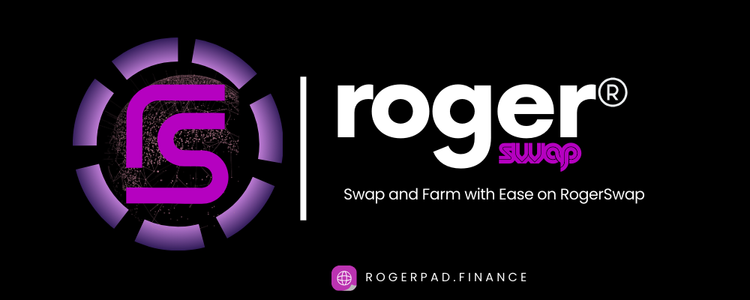

# Prime Token \[evm]

Prime Token is designed to offer project owners enhanced flexibility and control compared to a Simple Token. This type of token includes several advanced features that allow for a more tailored approach to managing and promoting your project.

<figure><figcaption></figcaption></figure>

Key Features of Prime Token:

1.  Buy and Sell Tax: max fee 25%

    Project owners can set specific tax rates on both the buying and selling of tokens. This feature allows you to generate revenue that can be reinvested into your project or used for other strategic purposes.
2.  Max Wallet and Max Transaction Amount:

    To ensure a balanced distribution of tokens and prevent market manipulation, Prime Token allows the setting of maximum wallet sizes and transaction amounts. This feature helps maintain market stability and investor confidence.
3. Tax Allocation for Marketing and Liquidity:
   1. The only allowable taxes on a Prime Token are for Marketing and Liquidity purposes. This ensures that the funds collected through transaction taxes are used to enhance the project’s visibility and stability.
   2. Marketing Tax: Funds collected through this tax can be used to promote the project, increasing its reach and attracting more investors.
   3. Liquidity Tax: This tax ensures that there is sufficient liquidity in the market, which helps in maintaining price stability and providing a better trading experience for investors.

Prime Token combines the simplicity of basic token features with advanced functionalities, offering a balanced and strategic tool for project owners to manage their crypto initiatives effectively.
