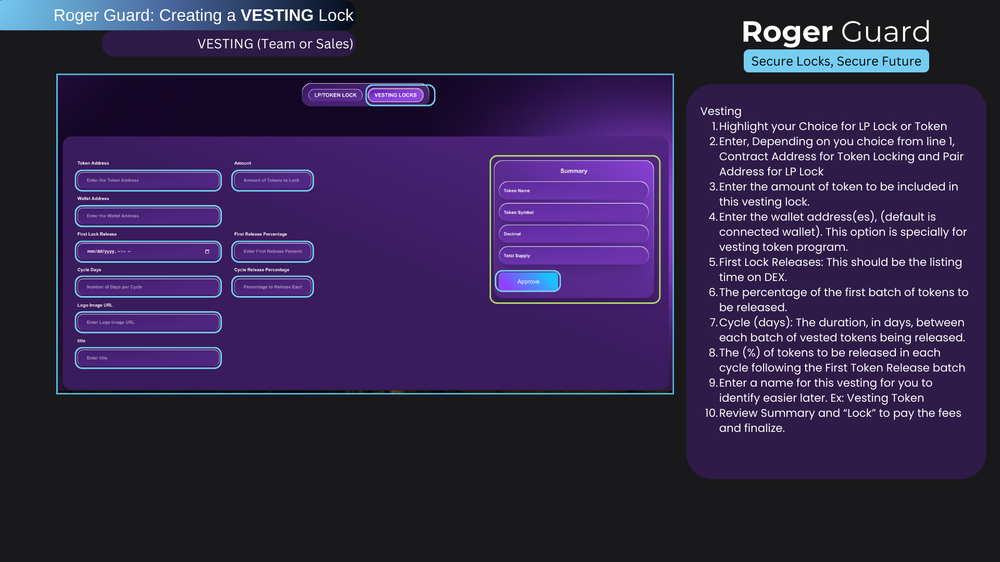

# Vesting \[evm]

<figure><figcaption></figcaption></figure>

In cryptocurrency, vesting lock refers to a mechanism where tokens are locked and released gradually over a specific period. This is often used to ensure the long-term commitment of project team members, early investors, or other stakeholders. Vesting schedules help prevent sudden large sell-offs of tokens (also called "token dumps") that could harm the project or its token value.

### Key Points of Vesting Lock:

1. Purpose: Builds trust by showing that founders and early investors are committed for the long term.
2. Schedule: Tokens are released in increments (e.g., monthly or quarterly) after an initial cliff period (a waiting period before any tokens are released).
3. Example: A team member may have 1,000 tokens under a one-year vesting schedule with a 3-month cliff. After 3 months, they start receiving 250 tokens every quarter.
4. Security: Tokens remain locked in a smart contract until their release, ensuring they cannot be accessed prematurely.



Vesting locks protect both the project and its investors by reducing market volatility and encouraging sustainable growth.
