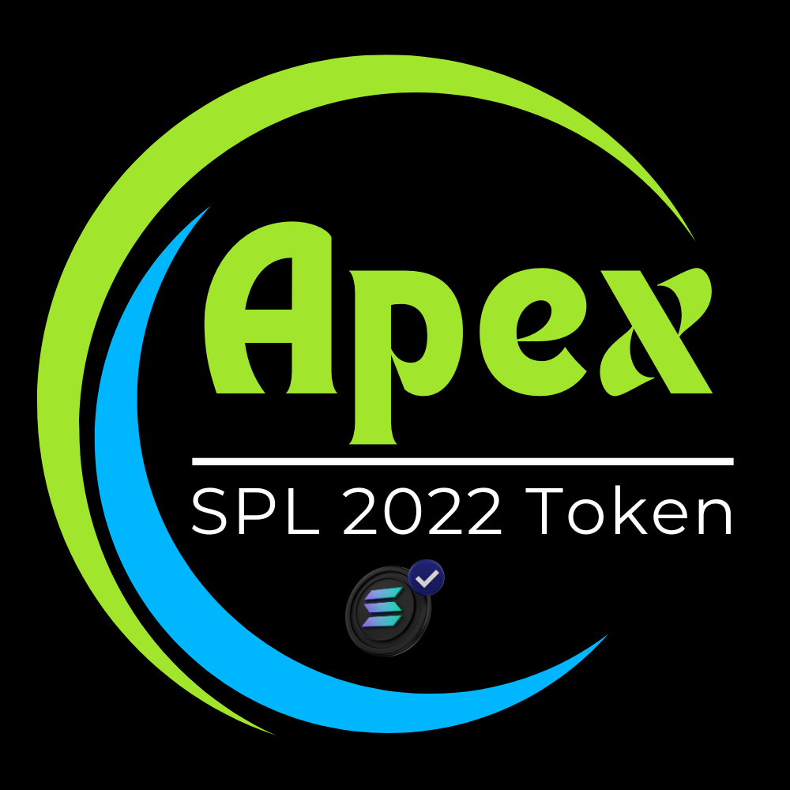

# Apex Contract

<figure><figcaption></figcaption></figure>

Our flagship tokens, aptly named the Apex Token Contract, represent the epitome of token innovation, leveraging the cutting-edge 2022 system. These tokens stand out for their comprehensive feature set, which includes advanced functionalities such as tax integration and a plethora of customizable options. Tailored to cater to the diverse requirements of our users, Apex Token Contracts offers a resilient and adaptable solution suitable for an extensive range of projects and applications.

> <mark style="color:orange;">The Apex Token Contract distinguishes itself by its seamless integration of tax mechanisms, allowing token creators to implement various taxation strategies effortlessly. This feature empowers creators to incorporate transaction taxes, redistribution taxes, or other tax mechanisms, enabling them to achieve specific objectives such as incentivizing holding, supporting liquidity, or funding community initiatives. The flexible tax options of the Apex Token Contract provide users with unparalleled control over the economic dynamics of their token ecosystem.</mark>

In addition to tax integration, Apex Token Contracts boast a plethora of customizable options, allowing for fine-tuning of every aspect of the token design. From supply parameters and distribution mechanisms to governance structures and utility functionalities, the versatility of Apex Token Contracts ensures that they can adapt seamlessly to the unique requirements of any project or application.

By harnessing the capabilities of Apex Token Contracts, users can unlock limitless possibilities for innovation and growth in their token endeavors. Whether launching a new token project, enhancing an existing ecosystem, or powering decentralized applications, Apex Token Contracts provide a robust foundation for driving success in the ever-evolving landscape of digital assets.

## <mark style="color:purple;">**Highlights**</mark>

Sales Categories:      [Presale ](../../../solana-chain/solana-chain/roger-pad-details/sales-categories/presale.md)| [Fair Launch](../../../solana-chain/solana-chain/roger-pad-details/sales-categories/fair-launch.md) | [Whiz Launch](../../../solana-chain/solana-chain/roger-pad-details/sales-categories/whiz-launch.md) | [Tier Launch](../../../solana-chain/solana-chain/roger-pad-details/sales-categories/tier-launch.md)

Type of. Sales:             [Conventional](../../../solana-chain/solana-chain/roger-pad-details/type-of-sales/conventional-launch.md) | [ Stealth](../../../solana-chain/solana-chain/roger-pad-details/type-of-sales/stealth-launch.md) | [Custom](../../../solana-chain/solana-chain/roger-pad-details/type-of-sales/custom-launch.md) | [Dyanmic](../../../solana-chain/solana-chain/roger-pad-details/type-of-sales/dynamic-launch.md) are available.

Pre Sale. Models:      [ Public Sale](../../../solana-chain/solana-chain/roger-pad-details/presale-models/public-sale.md) | [White List Sale](../../../solana-chain/solana-chain/roger-pad-details/presale-models/whitelist.md) | [White List Tiered](../../../solana-chain/solana-chain/roger-pad-details/presale-models/tiered-whitelist.md)

Sales Options:            [Bonus Sales Program](../../../solana-chain/solana-chain/roger-pad-details/varied-sales-options/bonus-sales-program.md) | [Affiliate Program](../../../solana-chain/solana-chain/roger-pad-details/varied-sales-options/affiliate-program/)  | [Buy Back Program](../../../solana-chain/solana-chain/roger-pad-details/varied-sales-options/buyback-program.md)

&#x20;                                      [Min/Max Transactions](../../../solana-chain/solana-chain/roger-pad-details/varied-sales-options/min-max-buy.md) | [Vesting Program](../../../solana-chain/solana-chain/roger-pad-details/varied-sales-options/vesting-program-of-rogerpad/) | [LP Lock](../../../solana-chain/solana-chain/roger-pad-details/varied-sales-options/lp-creation.md)

General Options:         [Immutable](../immutable-option.md) | [Freeze Authority ](../revoke-freeze.md)|[ MInt Auntorifity](../revoke-mint.md) | [OpenBook Market](../openbook-market-setup.md)


[General steps to create a contract:](../../../step-1-creating-a-token/minting-a-token/spl-2022-apex-token.md)


