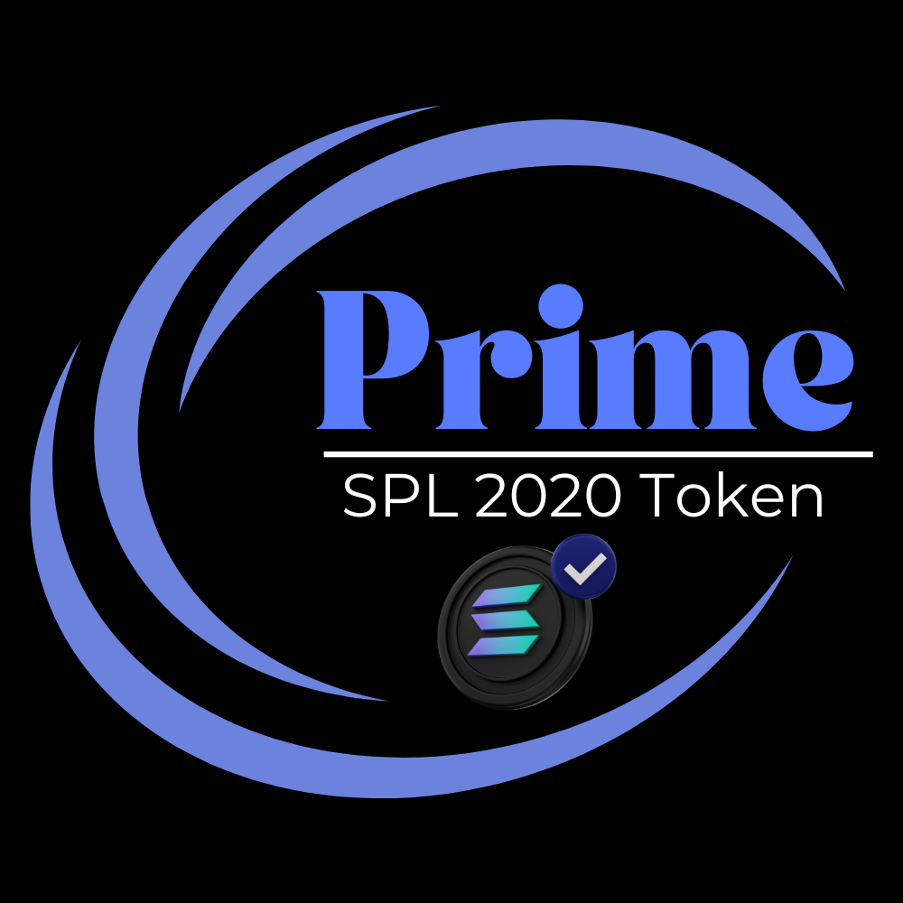

# Prime Contract

<figure><figcaption></figcaption></figure>

The Prime Token is the standard token offered by our platform and comes with a straightforward structure, devoid of any additional taxes or options. This simplicity ensures a clear and uncomplicated user experience, allowing for easy integration into various projects without the complexities associated with additional features.

There are a few limitations to this type of contract:

Sales Categories:  [    Presale ](../../../solana-chain/solana-chain/roger-pad-details/sales-categories/presale.md)& [Fair Launch](../../../solana-chain/solana-chain/roger-pad-details/sales-categories/fair-launch.md) only

Type of Sales:            [Conventional](../../../solana-chain/solana-chain/roger-pad-details/type-of-sales/conventional-launch.md) is available.

PreSale Models:        [Public Sale](../../../solana-chain/solana-chain/roger-pad-details/presale-models/public-sale.md) is available&#x20;

Sales Options:           [LP Lock](https://app.gitbook.com/o/K8SbUov0wU225b5zq22k/s/2tqbPa3m9HBIWVFa5iz7/\~/changes/40/creating-a-pool-roger-pad/step-2-creating-a-pool/liquidity-locking) | [Token Locking](https://app.gitbook.com/o/K8SbUov0wU225b5zq22k/s/2tqbPa3m9HBIWVFa5iz7/\~/changes/40/creating-a-pool-roger-pad/step-2-creating-a-pool/token-locking)

General Options:       [Immutable](../immutable-option.md) | [Freeze Authority](../revoke-freeze.md)| [MInt Auntorifity](../revoke-mint.md) | [OpenBook Market](../openbook-market-setup.md)

### <mark style="color:purple;">Prime Contracts</mark>

1. [PreSale Conventional](broken-reference)
2. [Fair Launch Conventional](broken-reference)


[General steps to create a contract:](../../../step-1-creating-a-token/minting-a-token/spl-2020-prime-token.md)


