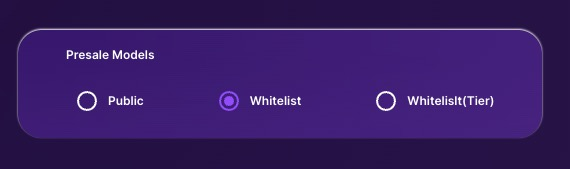

# PreSale Models

\
Introducing RogerPad's Tailored Sales Solutions, where we unlock your token launch potential with precision and flexibility. Our platform offers a range of presale options designed to cater to your project's unique needs, ensuring a seamless and effective fundraising experience.

&#x20;

<figure><figcaption></figcaption></figure>

### [PUBLIC SALE](public-sale.md)

Experience inclusivity and transparency in token distribution with a Public Sale, where investors of all backgrounds have equal access to project tokens. This open approach fosters trust and broad adoption, empowering everyone to contribute to the project's success. [More Info...](public-sale.md)

&#x20;

### [WHITELIST SALE](whitelist.md)

Join a select group of approved participants in a Whitelist Sale, where priority access is granted to early supporters, community members, and strategic partners. This exclusive opportunity not only rewards loyalty but also builds anticipation and momentum ahead of the token launch. [More Info...](whitelist.md)

&#x20;

### [TIERED WHITELIST SALE](tiered-whitelist.md)

Elevate your token sale experience with a Tiered Whitelist Sale, where participants enjoy tiered benefits based on their level of engagement. From early access to bonus tokens, each tier offers unique privileges, creating a sense of progression and excitement that drives community engagement.  [More Info...](tiered-whitelist.md)\
