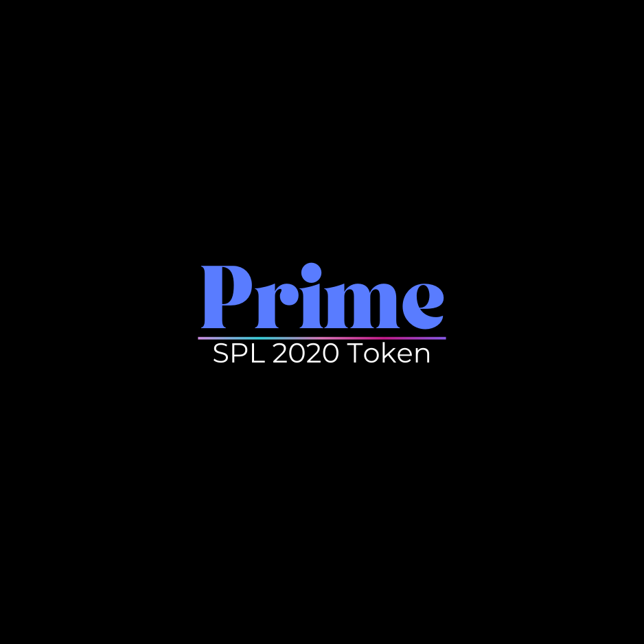
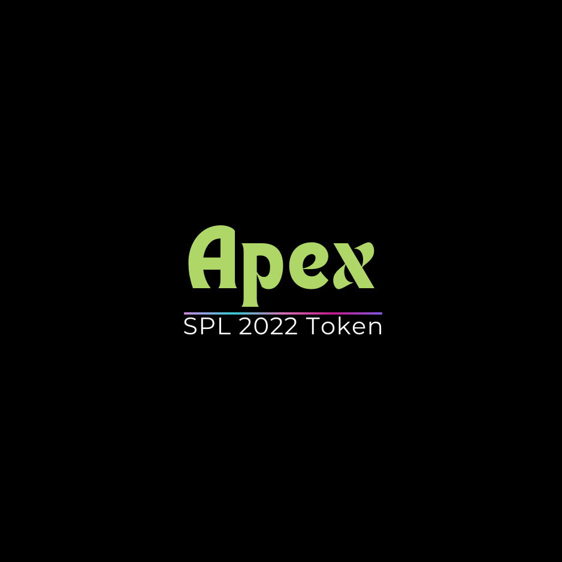

# Contract Types

## Prime Contract

<figure><figcaption></figcaption></figure>

SPL2020

The Prime Token is the standard token offered by our platform and comes with a straightforward structure, devoid of any additional taxes or options. This simplicity ensures a clear and uncomplicated user experience, allowing for easy integration into various projects without the complexities associated with additional features.

## Apex Contract

<figure><figcaption></figcaption></figure>

SPL2022

Our flagship tokens, known as Apex Tokens, utilize the cutting-edge 2022 system. These tokens offer a comprehensive range of features, including the ability to incorporate taxes and various other customizable options. Designed to meet the diverse needs of our users, Supreme Tokens provide a robust and versatile solution for a wide array of projects and applications.
