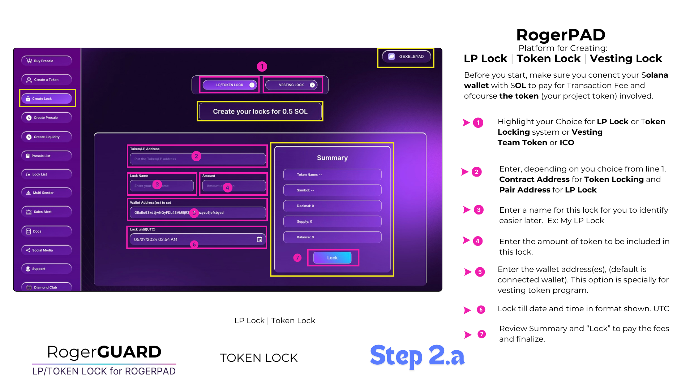

# Vesting Program of RogerPad

RogerPad's Vesting Program is designed with meticulous attention to detail, comprising two essential sections: Team Tokens Vesting and Presale Vesting Program.

### &#x20;LP LOCK | TOKEN LOCK | TEAM VESTING LOCK

<figure><figcaption></figcaption></figure>

### &#x20;[The Team Vesting System](broken-reference)

The Team Tokens Vesting section ensures that tokens allocated to team members are released gradually over a predetermined period. This approach incentivizes team members to remain committed to the project's long-term success, as tokens vesting over time aligns their interests with the project's growth trajectory. By gradually unlocking tokens, the vesting program mitigates the risk of team members selling off their tokens too quickly, thereby promoting stability and confidence within the project's ecosystem.

### [ The Presale Vesting System](the-presale-vesting-system.md)

Similarly, the Presale Vesting Program governs the distribution of tokens sold during the presale phase. Tokens purchased by early supporters and investors are subject to a vesting schedule, ensuring that they are released gradually over time. This not only encourages long-term participation but also safeguards against potential market volatility caused by a sudden influx of tokens. Moreover, it fosters a fair and transparent distribution process, enhancing trust and confidence among token holders.

&#x20;

Overall, RogerPad's Vesting Program is a crucial component of its token distribution strategy, fostering responsible token ownership and ensuring the project's sustained growth and stability.
