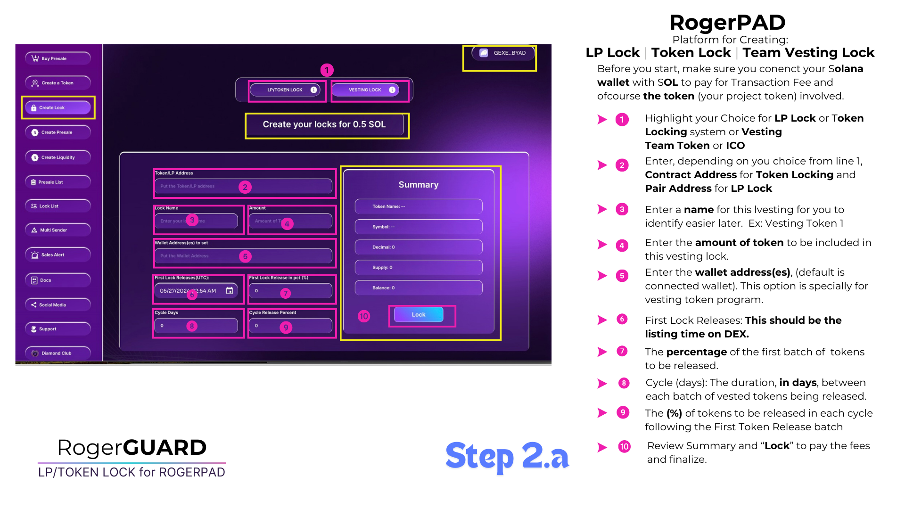

# The Team Vesting System

The Team Vesting System mandates project owners to lock team tokens, mitigating the risk of rug pulls and instilling investor trust. By fostering a secure environment and prioritizing investor protection, it enhances transparency and contributes to the project's long-term success.”

<figure><figcaption></figcaption></figure>

&#x20;The Team Vesting System is a robust protocol designed to fortify investor confidence by imposing stringent measures on project owners regarding the handling of team tokens. Under this system, project owners are mandated to lock their team tokens for a predetermined period, ensuring that they remain inaccessible for a specified duration. This strategic approach is instrumental in mitigating the risk of potential rug pulls, which often stem from the premature release of team tokens.

&#x20;By implementing the Team Vesting System, projects aim to instill a heightened sense of trust among investors. The commitment to locking team tokens underscores the project team's long-term commitment and dedication to the project's success. This assurance fosters a conducive environment for sustained growth and appreciation of token value over time.

&#x20;Moreover, the Team Vesting System serves as a robust deterrent against fraudulent activities commonly associated with unlocked tokens. By preventing team members from withdrawing and selling tokens immediately or shortly after listing, the system effectively mitigates the risk of rug pulls. This proactive measure not only safeguards investor interests but also upholds the project's integrity and credibility in the eyes of the community.

&#x20;In summary, the implementation of the Team Vesting System represents a significant step towards enhancing transparency, bolstering investor confidence, and safeguarding against malicious activities within the project ecosystem. By prioritizing investor protection and fostering trust, this comprehensive system contributes to the long-term success and sustainability of the project.
