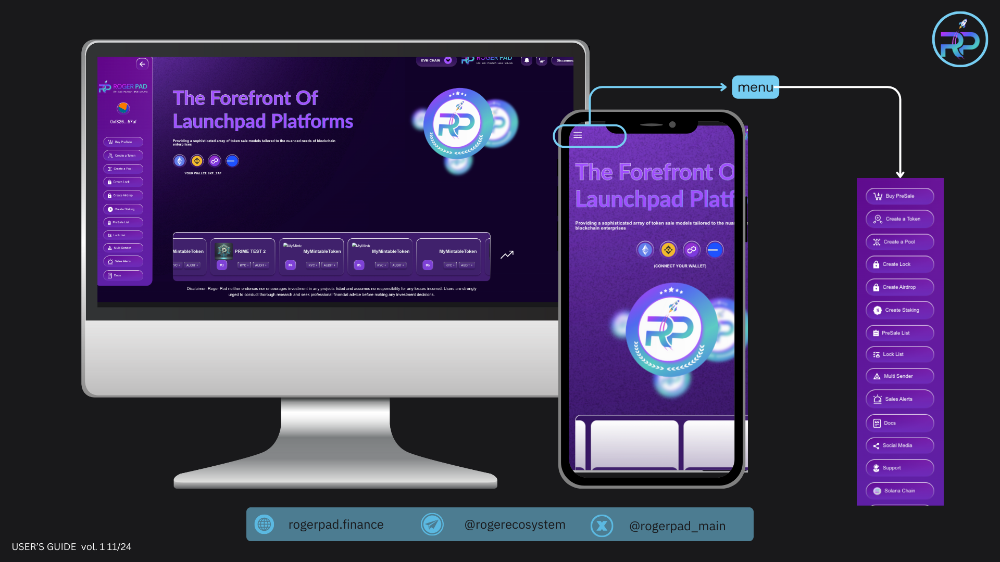

# FairLaunch

<figure><figcaption>
rogerpad.finance
</figcaption></figure>

### **PRESALE** (EVM Chains) ETH | BSC | POLYGON | BASE


**PRESALE** (EVM Chains) ETH | BSC | POLYGON | BASE

Link to Roger LaunchPad: [https://rogerpad.finance](https://rogerpad.finance)


1.  **Connect to the Appropriate Chain:**

    Ensure that you are connected to either the EVM chain or Solana chain via the top menu.

    Depending on the chain selected, the menu options on the left and top of the interface will adjust accordingly.
2.  **Select the Right Wallet and Tokens:**

    Connect your wallet, making sure the correct chain is selected.

    Ensure that you have both your project tokens and the Pair Token (Native Coin) in your wallet. These will be used to pay fees and create the pool.
3.  **Initiate Pool or Sale Creation:**

    Once your wallet is connected and tokens are ready, click on the "Create a Pool" or "Create a Sale" button to proceed.
