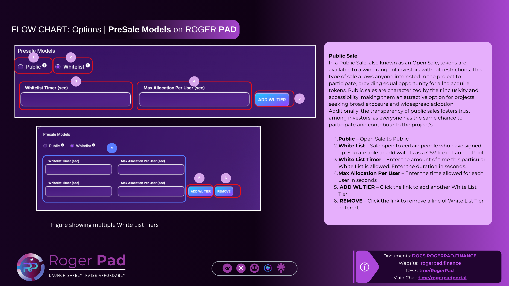

# PreSale Models

<figure><figcaption></figcaption></figure>

### <mark style="color:red;">Exclude LaunchPad Wallet Address: \[to be included] from all fees and taxes.</mark>


PreSale Models:

Public Sale | White List Sale | Tiered White List Sale.[ More Info..](https://docs.rogerpad.finance/devleopers-corner/presale-models)


*   **PreSale Models**

    1\.     **Public** – Open Sale to Public

    2\.     **White List** – Sale open to certain people who have signed up. You are able to add wallets as a   CSV file in Launch Pool.&#x20;

    3\.     **White List Timer** – Enter the amount of time this particular White List is allowed.  Enter the duration in seconds.

    4\.    **Max Allocation Per User** – Enter the time allowed for each user in seconds

    5\.  **ADD WL TIER** – Click the link to add another White List Tier.

    6\.     **REMOVE** – Click the link to remove a line of White List Tier entered.

