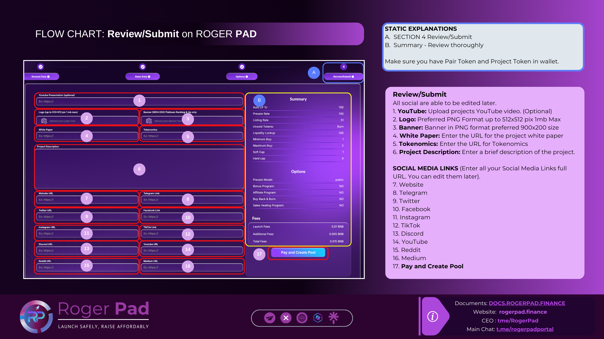

# Review/Submit

Step 4 | **Review/Submit**

This step involves entering your social media links, banner, and brief description. You will also have the opportunity to review all information, make payment, and create the pool.


**Please note** that while you can update the token description and social media details later, the token contract and sale details cannot be edited once approved.All social are able to be edited later.


<figure><figcaption></figcaption></figure>

-   1\.      YouTube:         Upload projects YouTube video. (Optional)

    2\.     Logo:                Preferred PNG Format up to 512x512 pix 1mb Max

    3\.     Banner:  Banner in PNG format preferred 900x200 size

    4\.     White Paper:  Enter the URL for the project white paper

    5\.     Tokenomics:   Enter the URL for Tokenomics

    6\.     Project Description:  Enter a brief description of the project.
-   SOCIAL MEDIA LINKS (Enter all your Social Media Links full URL.  You can edit them later).

    7\.      Website

    8\.     Telegram

    9\.     Twitter

    10\.     Facebook

    11\.     Instagram

    12\.     TikTok

    13\.     Discord

    14\.     YouTube

    15\.     15. Reddit

    16\.  16. Medium
- ***


17. **Pay and Create Pool**

