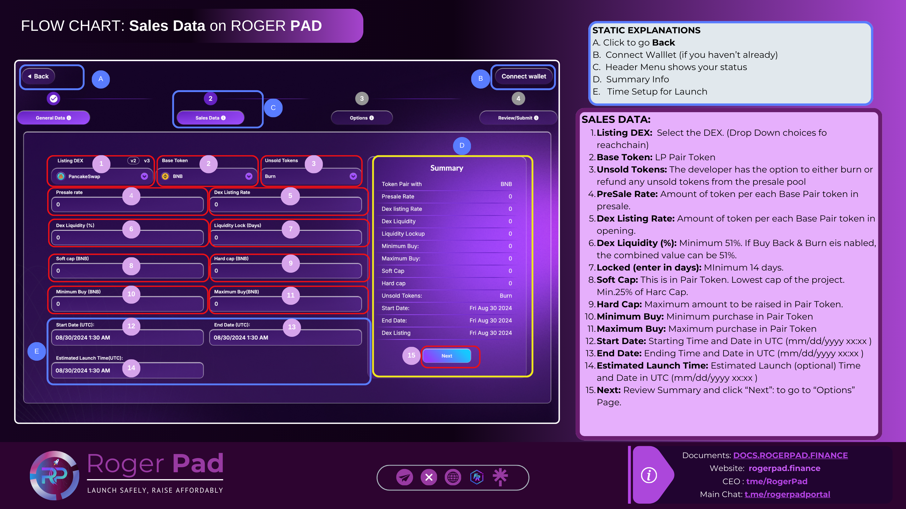

# Sales Data

<figure><figcaption>
Sales Data - PreSale
</figcaption></figure>

*   **SALES DATA:**

    &#x20;

    1\.      **Listing DEX:**  Select the DEX. (Drop Down choices for each chain)

    2\.   **Base Token**: LP Pair Token

    3\.     **Unsold Tokens:** The developer has the option to either burn or refund any unsold tokens from the presale pool

    4\.     **PreSale Rate:** Amount of token per each Base Pair token in presale.

    5\.     **Dex Listing Rate:** Amount of token per each Base Pair token in opening.

    6\.     **Dex Liquidity (%):** Minimum 51%. If Buy Back & Burn eis nabled, the combined value can be 51%.

    7\.     **Locked (enter in days).** MInimum 14 days.

    8\.     **Soft Cap:** This is in Pair Token.  Lowest cap of the project. Min.25% of Harc Cap.

    9\.     **Hard Cap:** Maximum amount to be raised in Pair Token.

    10\.  **Minimum Buy:** Minimum purchase in Pair Token

    11\.    **Maximum Buy:** Maximum purchase in Pair Token

    12\.   **Start Date:** Starting Time and Date in UTC (mm/dd/yyyy xx:xx )

    13\.   **End Date:** Ending Time and Date in UTC (mm/dd/yyyy xx:xx )

    14\.   **Estimated Launch Time:** Estimated Launch (optional) Time and Date in UTC (mm/dd/yyyy xx:xx )

    15\.   **Next:** Review Summary and click “Next”: to go to “Options” Page.
